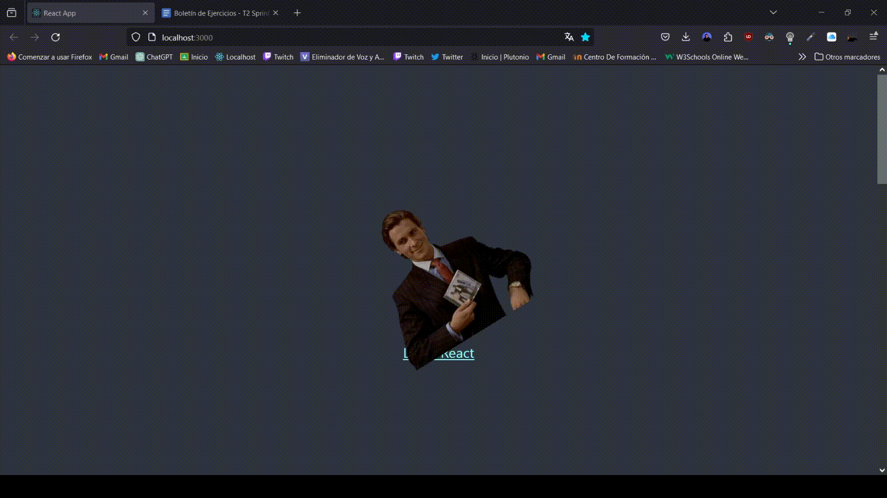
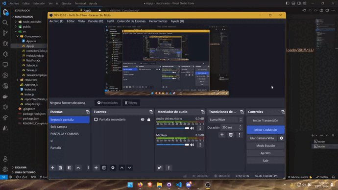
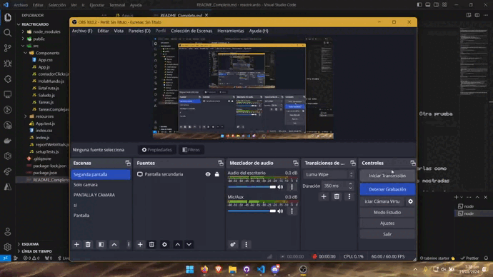
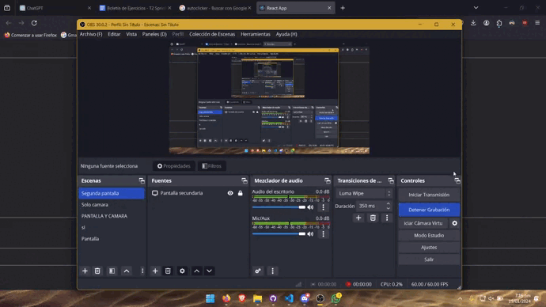
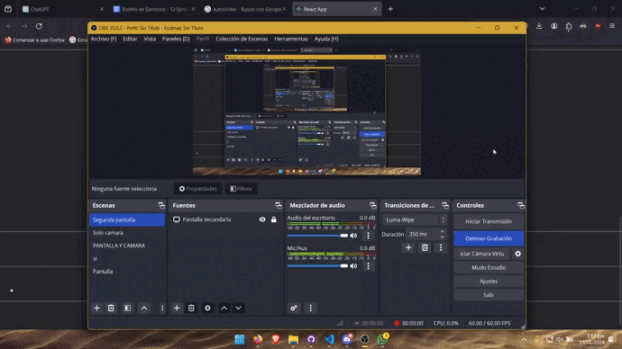

# Boletín de Ejercicios - T2 Sprint 1

## Análisis General de los ejercicios
Este proyecto consiste en una serie de ejercicios que se enfocan en el desarrollo de aplicaciones utilizando React. A continuación, se describen los ejercicios y sus objetivos.

## Ejercicio 1: Formulario de Registro con Validación

### Detalles del Ejercicio
Objetivo: Crear un componente de clase `FormularioRegistro` que incluya campos para el nombre de usuario, correo electrónico y contraseña, con validación de cada campo.

Tareas:
- Crea un componente de clase `FormularioRegistro` con un estado que contenga valores para nombre de usuario, correo electrónico, contraseña y mensajes de error para cada campo.
- Agrega métodos para manejar los cambios en cada campo del formulario y validar los datos ingresados (por ejemplo, verificar que el correo tenga un formato válido).
- El método `render` debe mostrar un formulario con campos para el nombre de usuario, correo electrónico, contraseña y mensajes de error correspondientes.
- Implementa estilos condicionales para mostrar los campos de texto en rojo si hay un error de validación.
- Renderiza `FormularioRegistro` en `App` y prueba la validación del formulario.

### Implementación ⚙️
[Código del ejercicio 1](reactricardo/src/Components/FormularioRegistro.js)

### Pruebas
Prueba: Asegúrate de que el formulario valida correctamente los datos y muestra mensajes de error. Verifica que los estilos de error se aplican correctamente a los campos inválidos.

---

## Ejercicio 2: Cronómetro con Inicio, Pausa y Reinicio

### Detalles del Ejercicio
Objetivo: Crear un componente de clase `Cronómetro` que funcione como un cronómetro con botones para iniciar, pausar y reiniciar el tiempo.

Tareas:
- Crea un componente de clase `Cronómetro` con un estado que incluya el tiempo transcurrido y si el cronómetro está activo o no.
- Implementa un método para iniciar el cronómetro que use `setInterval` para actualizar el tiempo cada segundo.
- Agrega métodos para pausar y reiniciar el cronómetro, actualizando el estado según corresponda.
- El método `componentWillUnmount` debe limpiar el intervalo para evitar fugas de memoria.
- El método `render` debe mostrar el tiempo transcurrido y botones para iniciar, pausar y reiniciar el cronómetro.
- Renderiza `Cronómetro` en `App` y prueba su funcionalidad.

### Implementación ⚙️
[Código del ejercicio 2](reactricardo/src/Components/Cronómetro.js)

### Pruebas
Prueba: Verifica que el cronómetro inicia, pausa y se reinicia correctamente. Comprueba que al eliminar el componente del DOM, el intervalo se limpia para evitar fugas de memoria.

---

## Ejercicio 3: Aplicación de Tareas con Filtrado y Almacenamiento Local

### Detalles del Ejercicio
Objetivo: Crear una aplicación de tareas (`AppTareas`) que permita añadir, eliminar, filtrar tareas y almacenarlas en el almacenamiento local del navegador.

Tareas:
- Crea un componente de clase `AppTareas` con un estado que incluya un arreglo de tareas, un campo de texto para nuevas tareas y un filtro de estado (todas, completadas, pendientes).
- Implementa funcionalidades para añadir nuevas tareas, marcarlas como completadas, eliminar tareas y filtrarlas según su estado.
- Usa `componentDidMount` para cargar las tareas almacenadas en el almacenamiento local y `componentDidUpdate` para actualizar el almacenamiento local cuando las tareas cambien.
- El método `render` debe mostrar un formulario para nuevas tareas, botones para filtrar, y una lista de tareas que refleje el filtro seleccionado.
- Renderiza `AppTareas` en `App` y prueba todas las funcionalidades.

### Implementación ⚙️
[Código del ejercicio 3](reactricardo/src/Components/AppTareas.js)

### Pruebas
Prueba: Asegúrate de que la aplicación permite añadir, eliminar, filtrar y marcar tareas. Verifica que las tareas persisten al recargar la página.

---

## Ejercicio 4: Galería de Imágenes con Carga Asíncrona y Modal

### Detalles del Ejercicio
Objetivo: Crear una galería de imágenes (`GaleriaImagenes`) que cargue imágenes de una API, las muestre en un grid y permita abrir una imagen en un modal al hacer clic.

Tareas:
- Crea un componente de clase `GaleriaImagenes` con un estado que incluya un arreglo de imágenes y la imagen seleccionada para el modal.
- En `componentDidMount`, realiza una petición a una API de imágenes (como Unsplash o similar) para cargar imágenes y guardarlas en el estado.
- Implementa un componente modal que se abra al hacer clic en una imagen, mostrando la imagen en tamaño completo.
- El método `render` debe mostrar un grid de imágenes y, si una imagen está seleccionada, el modal con la imagen.
- Renderiza `GaleriaImagenes` en `App` y prueba la carga de imágenes y la funcionalidad del modal.

### Implementación ⚙️
[Código del ejercicio 4](reactricardo/src/Components/GaleriaImagenes.js)

### Pruebas
Prueba: Verifica que las imágenes se cargan correctamente desde la API y que el modal funciona al hacer clic en las imágenes. Asegúrate de que el modal se cierra adecuadamente.

---

## Ejercicio 5: Galería de Imágenes con Carga Asíncrona, Modal y Funcionalidades Avanzadas

### Detalles del Ejercicio
Objetivo: Crear una galería de imágenes avanzada (GaleriaImagenesAvanzada) que cargue imágenes de una API, las muestre en un grid, permita abrir una imagen en un modal y ofrezca funcionalidades adicionales como búsqueda y paginación.

Tareas:
- **Componente de Clase GaleriaImagenesAvanzada**: Crea un componente con un estado que incluya un arreglo de imágenes, la imagen seleccionada para el modal, la página actual y términos de búsqueda.
- **Carga Asíncrona de Imágenes**:
  - En componentDidMount, realiza una petición a una API de imágenes (como Unsplash) para cargar imágenes y guardar
- **Carga Asíncrona de Imágenes**:
  - En componentDidMount, realiza una petición a una API de imágenes (como Unsplash) para cargar imágenes y guardarlas en el estado.
  - Implementa la paginación para cargar más imágenes cuando el usuario llegue al final del grid o mediante botones de navegación.
- **Búsqueda de Imágenes**:
  - Añade un campo de búsqueda para permitir a los usuarios buscar imágenes por términos específicos.
  - Actualiza la galería de acuerdo a los resultados de la búsqueda.
- **Componente Modal para Visualización de Imágenes**:
  - Implementa un componente modal que se abra al hacer clic en una imagen, mostrando la imagen en tamaño completo.
  - Añade funcionalidades al modal, como botones para navegar entre imágenes en la galería.
- **Renderizado y Prueba**:
  - El método render debe mostrar un campo de búsqueda, un grid de imágenes, controles de paginación y, si una imagen está seleccionada, el modal con la imagen.
  - Renderiza GaleriaImagenesAvanzada en App y prueba la carga de imágenes, la funcionalidad del modal, la búsqueda y la paginación.

### Implementación ⚙️
[Código del ejercicio 5](reactricardo/src/Components/TareasComplejas.js)

- **Prueba**:
  - Verifica que las imágenes se cargan correctamente desde la API y que la paginación funciona adecuadamente.
  - Asegúrate de que la búsqueda retorna resultados relevantes y actualiza el grid de imágenes.
  - Comprueba que el modal se abre al hacer clic en las imágenes y permite navegar entre ellas.
  - Confirma que todas las funcionalidades se integran armoniosamente y ofrecen una experiencia de usuario fluida.

[Plan de Pruebas](Plan_de_Pruebas.xlsx)
