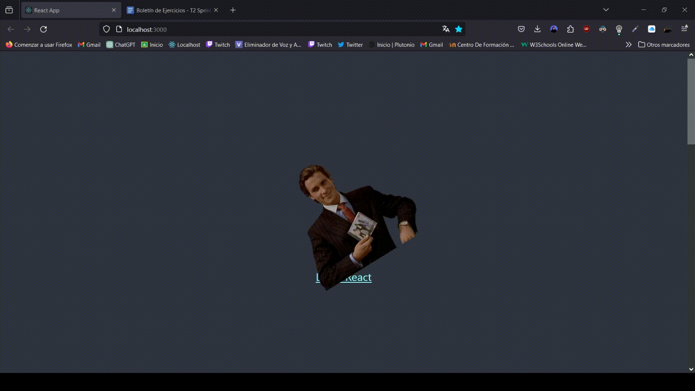
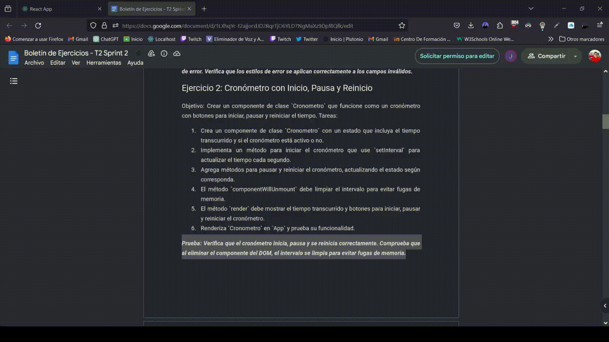

# Boletín de Ejercicios - T2 Sprint 1

## Análisis General de los ejercicios

## Ejercicio 1: 

### Detalles del Ejercicio

### Implementación ⚙️

[Codigo del ejercicio 1](reactricardo/src/Components/)

### Pruebas

---

## Ejercicio 2: 

### Detalles del Ejercicio

### Implementación ⚙️

[Codigo del ejercicio 2](reactricardo/src/Components/listaFruta.js)

### Pruebas

---

## Ejercicio 3: 

### Detalles del Ejercicio

### Implementación ⚙️

[Codigo del ejercicio 3](reactricardo/src/Components/contadorClicks.js)

### Pruebas

---

## Ejercicio 4: 

### Detalles del Ejercicio

### Implementación ⚙️

[Codigo del ejercicio 4](reactricardo/src/Components/Tareas.js)

### Pruebas

---

### Pruebas

[Plan de Pruebas](Plan_de_Pruebas.xlsx)
